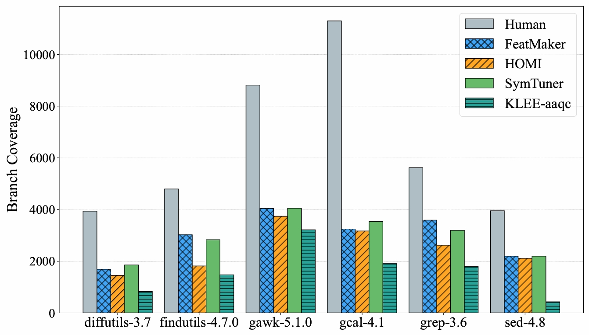

# Toward-Improving-Symbolic-Execution-Empirical-Lessons-from-Human-Written-Test-Cases
Repository for reproducibility - Symbolic executors' test cases and human's

LLVM version: 6.0.0

Coverage metrics: Branch coverage and the number of switch statements were computed using gcov.

Branch Coverage across all methods (measured with gcov) is identical to the attached JPEG: All_tools_branch_coverage.jpeg.

Test case data download: Available via Dropbox – [https://www.dropbox.com/scl/fo/vs0gbyv3iyqvxk5be5t0e/ADumGmvWRze-4sAhgKAppos?rlkey=vc4x2qzhon8cim5au3d4qqmqh&st=lrf2newr&dl=0
](https://www.dropbox.com/scl/fo/vs0gbyv3iyqvxk5be5t0e/ADumGmvWRze-4sAhgKAppos?rlkey=q3mbw9414q3jo3hqbta9fu3jn&st=ummxw3we&dl=0)
